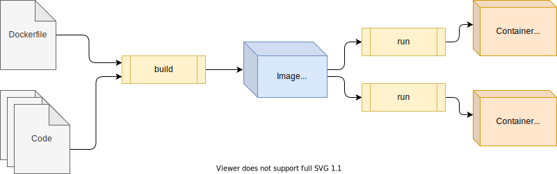
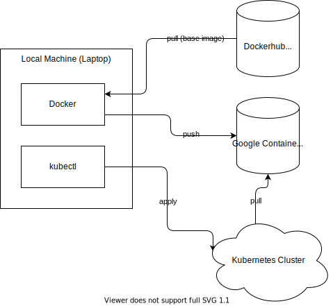
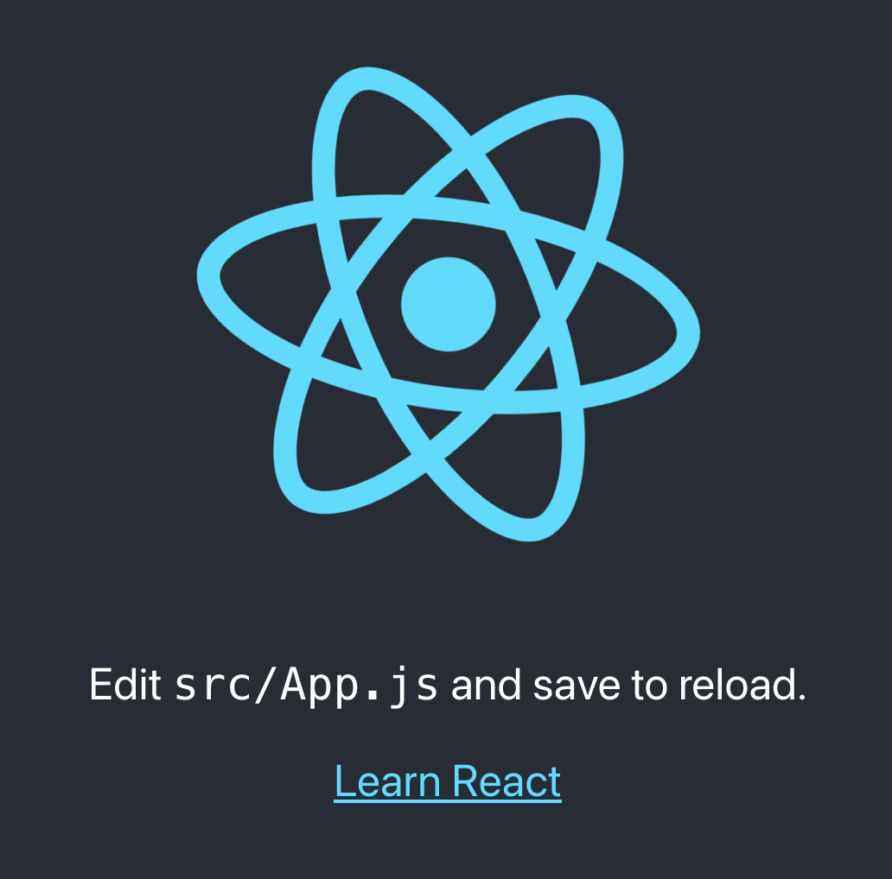

## Concepts

### Images and Containers

See [this article](https://www.padok.fr/en/blog/container-docker-oci) for a more in-depth explanation.

An **OCI Image** is a snapshot of a file system and instructions for how to start a process. Images are read-only. Images can be transferred from machine to machine.

An **OCI Container** is a read-write copy of the image. You can think of it as a running process, based on the image.

A **Dockerfile** is a recipe for an image. To create an image from a Dockerfile you must **build** the image:



In this workshop you will interact with several different components:



## Install Google Cloud SDK (gcloud)

https://cloud.google.com/sdk/docs/install

If you have homebrew (on linux or mac) you may also try:

```
brew install --cask google-cloud-sdk
```

## Login to Google Cloud

```
gcloud auth login
```

## Login to the Cluster

```
gcloud container clusters get-credentials csu-workshop --region us-central1-c --project csu-workshop-333616
```

To check that you are logged in, run:

```
kubectl get nodes
```

You should see something like:

```
NAME                                          STATUS   ROLES    AGE   VERSION
gke-csu-workshop-default-pool-b7f37c6f-0dld   Ready    <none>   27m   v1.21.5-gke.1302
gke-csu-workshop-default-pool-b7f37c6f-3cw3   Ready    <none>   27m   v1.21.5-gke.1302
gke-csu-workshop-default-pool-b7f37c6f-41fk   Ready    <none>   27m   v1.21.5-gke.1302
gke-csu-workshop-default-pool-b7f37c6f-kh1b   Ready    <none>   27m   v1.21.5-gke.1302
```

## Create a React App

```
npx create-react-app react-example --use-npm --scripts-version=4.0.3
```

`cd` into the newly-created directory:

```
cd react-example
```

Add a dockerfile:

```
cat <<EOF > Dockerfile
FROM node:16-alpine as build
WORKDIR /app
COPY . .
RUN npm install
RUN npm run build

FROM nginxinc/nginx-unprivileged
COPY --from=build /app/build /usr/share/nginx/html
EOF
```

And a `.dockerignore`:

```
cat <<EOF > .dockerignore
node_modules
EOF
```

Build and run the docker app locally:

1. Set the image name (based on your computer's username):

  ```
  export IMAGE=us-central1-docker.pkg.dev/csu-workshop-333616/workshop/$USERNAME-react:v1
  ```

1. Build the image:

  ```
  docker build --no-cache -t $IMAGE .
  ```

1. Run the app locally inside Docker:

  ```
  docker run -it -p 8080:8080 --rm $IMAGE
  ```

1. Open the application locally at http://localhost:8080 to make sure it's running

  

1. Stop the running application with `CTRL+C`


## Docker Login

```
gcloud auth configure-docker us-central1-docker.pkg.dev
```

## Push the Image

```
docker push $IMAGE
```

## Create a Kubernetes Namespace

```
kubectl create namespace $USERNAME
```

## Create Deployment Configuration File

Create a `deployment.yaml` file:

```
cat <<EOF > deployment.yaml
apiVersion: apps/v1
kind: Deployment
metadata:
  name: react
  namespace: $USERNAME
  labels:
    app: react
spec:
  replicas: 1
  selector:
    matchLabels:
      app: react
  template:
    metadata:
      labels:
        app: react
    spec:
      containers:
        - name: react
          image: $IMAGE
          ports:
            - containerPort: 8080
EOF
```

## Deploy Your Application

```
kubectl apply -f deployment.yaml
```

You should see:

```
deployment.apps/react created
```

**List your pods**

```
kubectl get pods -n $USERNAME
```

## Create the Service Configuration File

```
cat <<EOF > service.yaml
apiVersion: v1
kind: Service
metadata:
  name: react
  namespace: $USERNAME
spec:
  selector:
    app: react
  ports:
    - protocol: TCP
      port: 80
      targetPort: 8080
  type: LoadBalancer
EOF
```

## Create the Service

```
kubectl apply -f service.yaml
```

## Get the IP address

Run this command. It may take a few minutes before the external IP appears

```
kubectl get svc -n $USERNAME -w
```

Once it appears, click `CTRL+C` to stop the process.